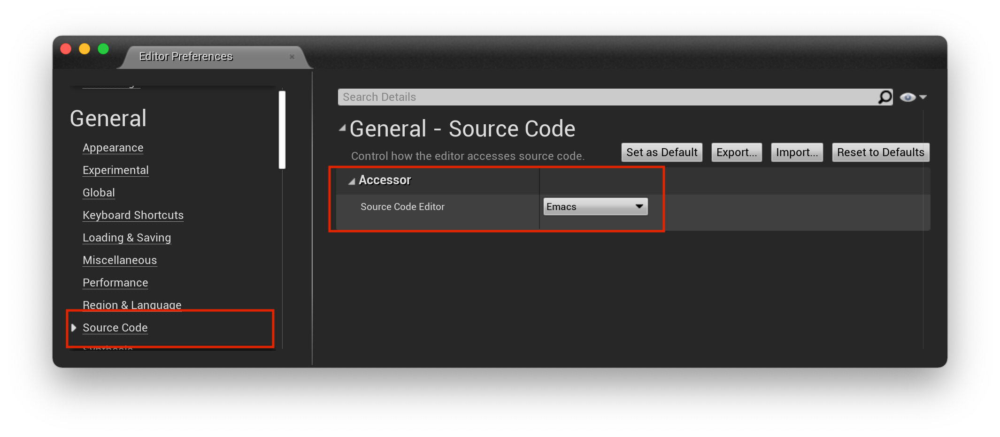
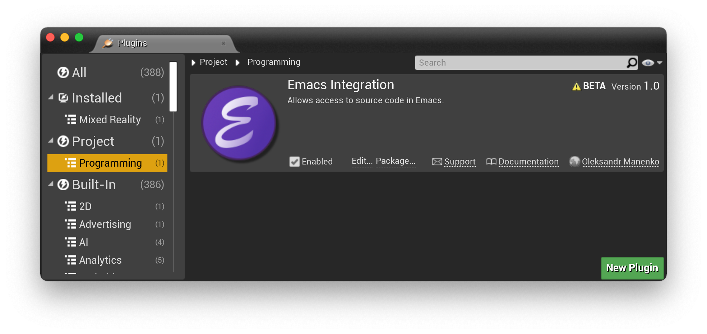

# Emacs Source Code Accessor for Unreal Editor

## Synopsis

**Emacs Source Code Accessor** is a plug-in for Unreal Editor that adds Emacs to the list of source code editors.

[[_TOC_]]

## Installation

### Installing the Plug-in

1. Clone the repository to the `Plugins` directory of your Unreal Engine project (create the directory if it does not exist). Make sure you have no Unreal Editor opened.
2. Open the project in the Unreal Editor.
3. The Editor will ask you to rebuild your project modules. Agree with the request.
4. The Editor should have `Emacs` item in the list of the source code editors.
5. Select `Emacs`. Optionally, set it as a default source code accessor.
6. Restart the Editor.
7. Done.

### Optional Patch for Unreal Build Tool

This section is for those who use [lsp](https://emacs-lsp.github.io/lsp-mode/), [rtags](https://github.com/Andersbakken/rtags), or any other autocompletion package that requires a Clang compilation database.

You can apply a patch to the UnrealBuildTool source code which generates a Clang compilation database (`compile_commands.json`) in the project root each time Unreal Editor refreshes the project.

#### Prerequisites

##### Patch Command Line Utility

You need access to the `patch` command. 
GNU/Linux and macOS users should have it installed by default. 
Windows users could use Git Bash or WSL.

##### Clang Compiler

GNU/Linux users should be able to install it via package manager; macOS users should have it already installed alongside with Xcode.

Windows users can download the installer from the LLVM Project [Releases](https://github.com/llvm/llvm-project/releases). Version [12.0.1](https://github.com/llvm/llvm-project/releases/download/llvmorg-12.0.1/LLVM-12.0.1-win64.exe) should do fine. Make sure you install it to the default location (`C:\Program Files\LLVM`) otherwise Unreal Engine will not be able to find it.
</details>

#### Applying the Patch to Unreal Build Tool Source Code:

1. Download the [patch](Source/UBT/UBT_UnrealEmacs.diff) to the Engine root directory.
2. Change directory to the Engine root directory.
3. Apply the patch: `patch -p1 < UBT_UnrealEmacs.diff`.
4. Rebuild the UnrealBuildTool.

#### Rebuilding UnrealBuildTool on GNU/Linux

Make sure the source files are writeable.
You may need to change access permissions to the Engine root directory and its contents recursively.

Issue the following commands:

```shell
$ source Engine/Build/BatchFiles/Linux/SetupEnvironment.sh 
$ xbuild Engine/Source/Programs/UnrealBuildTool/UnrealBuildTool.csproj
```

#### Rebuilding UnrealBuildTool on macOS

Make sure the source files are writeable.
You may need to change access permissions to the Engine root directory and its contents recursively.

Issue the following commands:

```shell
$ bash
bash-3.2$ source Engine/Build/BatchFiles/Mac/SetupEnvironment.sh 
bash-3.2$ xbuild Engine/Source/Programs/UnrealBuildTool/UnrealBuildTool.csproj
bash-3.2$ exit
```

#### Rebuilding UnrealBuildTool on Windows

Make sure the source files are writeable. You may need to clear 'Read-only' flag
on the Engine root directory and its content recursively.

Go to the Start menu and enter "dev" or "developer command prompt".
This should bring up a list of installed apps that match your search pattern.
Select "Developer Command Prompt".
If it is not there, then you can find it manually at `<visualstudio installation folder>\<version>\Common7\Tools\LaunchDevCmd.bat`.
You also must have the .NET development tools and .NET framework target packs installed.

Issue the following command:

```shell
msbuild Engine/Source/Programs/UnrealBuildTool/UnrealBuildTool.csproj
```

## Screenshots

<details><summary>Editor Preferences</summary>

</details>
<details><summary>Menu File/Open Emacs</summary>

</details>
<details><summary>Emacs Integration enabled in the Editor Plugins</summary>

</details>

## Video

You can watch the plug-in in action on [YouTube](https://www.youtube.com/watch?v=x73daC58qQc).

## Usage

In the Unreal Editor you can:

- Use menu item `File/Open Emacs` to open the project in Emacs.
- Use menu item `File/New C++ Class...` to create a new C++ class and open its files in Emacs.
- Use menu item `File/Refresh Emacs Project` to regenerate the Clang compilation database. Use should patch the UnrealBuildTool as described in this document to have access to this feature.
- Right click on a C++ class in the Unreal Editor, choose `Create C++ class dirived from CLASSNAME` menu item to create a new class and open its files in Emacs.

### Emacs Server

The plug-in uses `emacsclient` (`emacsclientw` on Windows) to open a project's source code files.

If there is no [Emacs server](https://www.gnu.org/software/emacs/manual/html_node/emacs/Emacs-Server.html) running, the
plug-in opens a new Emacs frame (a GUI window) each time it is asked to open a file. 
If you don't like this behavior, make sure you have a server running.
The easiest way to achieve this is by adding the following lines to your Emacs `init.el`:

```elisp
(require 'server)
(when (not (server-running-p))
  (server-start))
```

### Specifying Emacs Binary Directory Location

The plug-in should work without any additional configuration on GNU/Linux, macOS, and Windows.
By default it searches for Emacs binary directory in the following locations:

- GNU/Linux: `/usr/local/bin`.
- macOS: `/usr/local/bin`.
- Windows: `C:/Program Files/Emacs/x86_64/bin`.

If you have Emacs installed in a different location, then set `UNREAL_EMACS_EMACSDIR` environment variable to a full path to the Emacs binary directory.

The plug-in uses `UNREAL_EMACS_EMACSDIR/emacsclient` and `UNREAL_EMACS_EMACSDIR/emacs` on GNU/Linux and macOS; and `UNREAL_EMACS_EMACSDIR/emacsclientw.exe` and `UNREAL_EMACS_EMACSDIR/runemacs.exe` on Windows.

## Projectile Unreal

You may want to try another work-in-progress project of mine: [ue.el](https://gitlab.com/unrealemacs/ue.el) which is a minor mode for Emacs that works with Unreal Engine projects generated by this project.

## License

MIT
